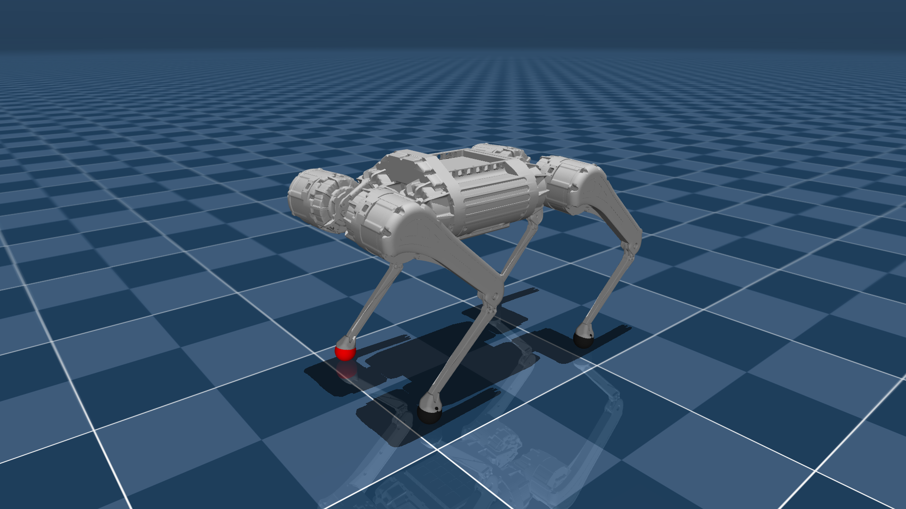

# MAB Robotics HB50 Description (MJCF)

> [!IMPORTANT]
> Requires MuJoCo 2.3.7 or later.

## Changelog

See [CHANGELOG.md](./CHANGELOG.md) for a full history of changes.

## Overview

This package contains a robot description (MJCF) of the [HB50](https://www.mabrobotics.pl/honey-badger-5) quadruped
developed by [MAB Robotics](https://www.mabrobotics.pl/). It is derived from the MJCF in
[robot_models](https://github.com/mabrobotics/robot_models). See the
[Honey Badger documentation](https://mabrobotics.github.io/hb-docs/intro.html) for details on the robot.

  

## Derivation steps

1. Copied `hb50.xml` and `scene.xml` from
   [robot_models/mujoco/hb50](https://github.com/mabrobotics/robot_models/tree/main/mujoco/hb50).
2. Copied the STL visual meshes from
   [robot_models/meshes/hb50/visual](https://github.com/mabrobotics/robot_models/tree/main/meshes/hb50/visual) into
   `assets/` and removed the `hb50_` prefix from the file names.
3. Set `meshdir="assets"` in `<compiler>` and moved the common mesh scale into the `<default>` section.
4. Removed the `<statistic>` override from `scene.xml`.
5. Left out the ramp and room scenes, which depend on files outside the model directory.

## License

This model is released under an [Apache-2.0 License](LICENSE).
